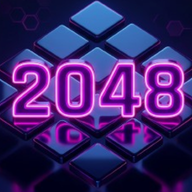

  
  
  # 2048 - RimuGames 🎮
  
  Um clone moderno, polido e animado do clássico jogo 2048.
  
  
  
  
  

 

Este projeto faz parte do **RimuGames**, uma coleção com vários games (principalmente offline) criados para você poder jogar e se divertir em qualquer lugar, sem depender de conexão com a internet.

## 🎯 O que o projeto faz?
O jogo segue a mecânica clássica do 2048: você desliza as peças no tabuleiro para juntar números iguais. Quando duas peças com o mesmo número se tocam, elas se fundem em uma só com o dobro do valor. O objetivo principal é alcançar a tão desejada peça **2048**!

**Destaques e Funcionalidades:**
- **Jogue Offline:** Graças ao suporte a PWA (Progressive Web App) com Service Workers (`sw.js`) e `manifest.json`, o jogo pode ser instalado e acessado totalmente sem internet.
- **Fundo Animado (Partículas):** Possui um sistema de partículas rodando no fundo que cria conexões e, de tempos em tempos, forma desenhos dinâmicos e adaptativos (como corações ou o formato de uma gata).
- **Controles Responsivos:** Suporta tanto o uso do teclado (setas direcionais) para jogar no computador, quanto toques e deslizes (*swipe*) na tela para dispositivos móveis.
- **Persistência de Dados:** Salva automaticamente a sua melhor pontuação localmente no navegador, para que você possa continuar tentando bater seu próprio recorde.
- **Modo Foco / Telas de Vitória:** Telas de *Game Over* e *Vitória* integradas, com opções para tentar novamente ou continuar jogando após alcançar o 2048.

## 🛠️ Tecnologias Usadas
- **HTML5 & CSS3:** Estrutura e estilização moderna, utilizando Grid/Flexbox e uma paleta de cores focada em um belo *dark mode* em tons de roxo e neon.
- **JavaScript (ES6+):** Arquitetura baseada em Orientação a Objetos e módulos (`game.js`, `particles.js`, `main.js`), garantindo um código limpo e organizado.
- **Canvas API:** Utilizada de forma nativa para o sistema avançado de física e renderização da rede de partículas.
- **Service Workers & PWA:** Tecnologias web modernas para gerenciar cache de arquivos e permitir a funcionalidade offline.
- **Fetch API & JSON:** Consumo assíncrono do arquivo `shapes.json` que contém as coordenadas dos desenhos de partículas.
- **FontAwesome:** Ícones utilizados nas interfaces, pontuações e botões.

## 🚀 Como executar
1. Baixe os arquivos do projeto.
2. Como o projeto utiliza requisições `fetch` (para os dados do Canvas) e *Service Workers*, é necessário rodá-ho em um servidor local (ex: extensão **Live Server** no VSCode ou um servidor HTTP em Node/Python).
3. Abra o endereço local no seu navegador.
4. Para a melhor experiência offline no celular, adicione a página à Tela Inicial usando o recurso do próprio navegador.

---
Desenvolvido por **Lucas Toniato Dev** | [GitHub](https://github.com/lucastonidev) | [Instagram](https://www.instagram.com/lucastoni0101/)